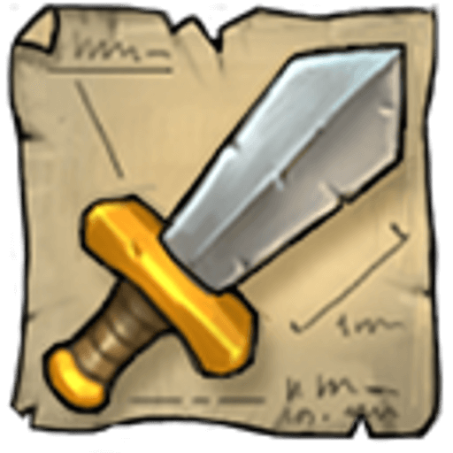

<h1 align="center">
  
  Celeste Item Search
</h1>

 Find items by name, slot, quality, level, effect, material or shop.

  
  
  
  

## Contributing

Want to suggest a feature or report a bug? [Create an issue](https://github.com/n4bb12/celeste-item-search/issues/new).

Interested in writing a pull request? See the [contribution guide](CONTRIBUTING.md).

#

#### Source Code License

The source code is licenced under the [ISC License](LICENSE).

#### Game Content Usage Notice

Age of Empires Online © Microsoft Corporation. This repository was created under Microsoft's [Game Content Usage Rules](https://www.xbox.com/en-us/developers/rules) using assets from Age of Empires Online, and it is not endorsed by or affiliated with Microsoft.
